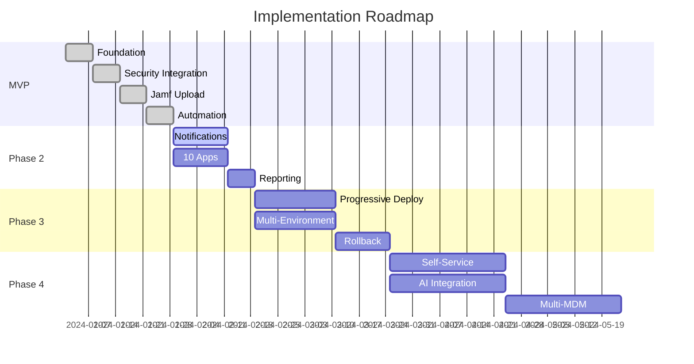

# Full Implementation Roadmap - Cloud AutoPkg Runner

## Vision Statement

Transform macOS application patching from a manual, reactive process into an intelligent, automated security pipeline that reduces vulnerability windows from days to hours while maintaining complete control and visibility.

## Implementation Phases Overview



## Phase 1: MVP (Weeks 1-4) ✅

**Status**: Foundation Complete

See [MVP_IMPLEMENTATION.md](./MVP_IMPLEMENTATION.md) for detailed MVP implementation.

### Deliverables:
- ✅ Core pipeline with 3-5 apps
- ✅ Security validation
- ✅ Basic Jamf upload
- ✅ Scheduled automation

## Phase 2: Enhanced Automation (Weeks 5-8)

**Goal**: Add operational intelligence and expand coverage

### 2.1 Notification System

#### Implementation:
```python
# Notification channels
class NotificationManager:
    def __init__(self):
        self.channels = {
            'email': EmailNotifier(),
            'slack': SlackNotifier(),
            'teams': TeamsNotifier(),
            'webhook': WebhookNotifier()
        }
    
    def notify(self, event, severity='info'):
        # Route based on severity
        if severity == 'critical':
            self.channels['email'].send(event)
            self.channels['slack'].send(event)
        elif severity == 'warning':
            self.channels['slack'].send(event)
```

#### Features:
- **Email**: Critical failures, weekly summaries
- **Slack**: Real-time updates, success/failure
- **Teams**: Integration with corporate chat
- **Webhooks**: Custom integrations

### 2.2 Application Expansion (10+ Apps)

#### New Applications:
```yaml
# Tier 1 (Stable, well-tested)
- GoogleChrome.jamf
- Firefox.jamf
- Zoom.jamf
- Slack.jamf
- MicrosoftTeams.jamf

# Tier 2 (Moderate complexity)
- VSCode.jamf
- Docker.jamf
- Postman.jamf
- TablePlus.jamf
- Rectangle.jamf

# Tier 3 (Complex, requires testing)
- AdobeCreativeCloud.jamf
- MicrosoftOffice.jamf
- Parallels.jamf
```

### 2.3 Advanced Reporting Dashboard

#### Components:
```javascript
// Dashboard metrics
const metrics = {
  overview: {
    totalApps: 10,
    successRate: 98.5,
    avgDeployTime: '6.3 hours',
    vulnerabilitiesPatched: 47
  },
  
  appStatus: [
    {name: 'Chrome', version: '120.0', lastUpdate: '2h ago', status: 'success'},
    {name: 'Firefox', version: '121.0', lastUpdate: '4h ago', status: 'success'},
    {name: 'Zoom', version: '5.17', lastUpdate: '1d ago', status: 'warning'}
  ],
  
  securityMetrics: {
    signaturesVerified: 156,
    malwareBlocked: 2,
    complianceRate: 100
  }
};
```

#### Deliverables:
- Web-based dashboard (React/Next.js)
- Real-time status updates
- Historical trend analysis
- Export capabilities (PDF/CSV)

## Phase 3: Enterprise Features (Weeks 9-14)

**Goal**: Production-ready enterprise capabilities

### 3.1 Progressive Deployment

#### Strategy:
```yaml
# Deployment rings
rings:
  canary:
    size: 1%
    duration: 24h
    rollback_threshold: 5_errors
    
  pilot:
    size: 10%
    duration: 48h
    rollback_threshold: 2%_failure
    
  production:
    size: 89%
    staged: true
    batch_size: 25%
```

#### Implementation:
- Smart group creation in Jamf
- Gradual rollout orchestration
- Health monitoring per ring
- Automatic progression/halt

### 3.2 Multi-Environment Support

#### Environments:
```json
{
  "environments": {
    "development": {
      "jamf_url": "https://dev.jamfcloud.com",
      "apps": ["Chrome", "Firefox"],
      "validation": "relaxed"
    },
    "staging": {
      "jamf_url": "https://stage.jamfcloud.com",
      "apps": ["all"],
      "validation": "strict"
    },
    "production": {
      "jamf_url": "https://prod.jamfcloud.com",
      "apps": ["approved_only"],
      "validation": "strict",
      "approval_required": true
    }
  }
}
```

### 3.3 Intelligent Rollback

#### Capabilities:
- Automatic failure detection
- Previous version restoration
- Dependency management
- Rollback reporting

```python
class RollbackManager:
    def detect_failure(self, metrics):
        if metrics['crash_rate'] > threshold:
            return self.initiate_rollback()
        if metrics['user_complaints'] > threshold:
            return self.request_approval()
    
    def initiate_rollback(self):
        # 1. Stop current deployment
        # 2. Restore previous version
        # 3. Notify stakeholders
        # 4. Generate incident report
```

## Phase 4: Advanced Automation (Weeks 15-24)

**Goal**: Self-managing, intelligent patching system

### 4.1 Self-Service Portal

#### Features:
```typescript
interface SelfServicePortal {
  // User capabilities
  requestApp(appName: string): Promise<ApprovalRequest>;
  trackRequest(id: string): RequestStatus;
  reportIssue(appName: string, issue: Issue): Ticket;
  
  // Admin capabilities
  approveApp(request: ApprovalRequest): void;
  addRecipe(recipe: Recipe): ValidationResult;
  setPolicy(app: string, policy: Policy): void;
  viewAnalytics(): Dashboard;
}
```

#### Components:
- Web interface for app requests
- Automated recipe generation
- Approval workflow
- Integration with ticketing system

### 4.2 AI-Powered Intelligence

#### ML/AI Features:

1. **Failure Prediction**
```python
# Predict likelihood of update failure
model = FailurePredictionModel()
risk_score = model.predict({
    'app': 'Chrome',
    'version_jump': '2.0',
    'historical_success': 0.95,
    'complexity_score': 7.2
})
```

2. **Optimal Deployment Timing**
```python
# Find best time to deploy
optimizer = DeploymentOptimizer()
best_window = optimizer.calculate({
    'app_usage_patterns': usage_data,
    'business_hours': company_schedule,
    'historical_incidents': past_issues
})
```

3. **Anomaly Detection**
```python
# Detect unusual behavior
detector = AnomalyDetector()
alerts = detector.analyze({
    'download_size': package.size,
    'signature': package.signature,
    'behavior': post_install_telemetry
})
```

### 4.3 Multi-MDM Support

#### Supported Platforms:
```yaml
mdm_adapters:
  - name: Jamf Pro
    type: primary
    features: [full]
    
  - name: Kandji
    type: secondary
    features: [upload, policy]
    
  - name: Mosyle
    type: secondary
    features: [upload]
    
  - name: Microsoft Intune
    type: experimental
    features: [basic]
```

## Phase 5: Platform Evolution (Months 7-12)

**Goal**: Industry-leading patching platform

### 5.1 Advanced Features

#### Recipe Marketplace
```javascript
// Community recipe sharing
const marketplace = {
  browse: () => Recipe[],
  submit: (recipe: Recipe) => ValidationResult,
  rate: (recipeId: string, rating: number) => void,
  fork: (recipeId: string) => Recipe,
  subscribe: (vendor: string) => Subscription
};
```

#### Compliance Automation
```python
# Automatic compliance reporting
compliance_manager = ComplianceManager()
compliance_manager.generate_report({
    'standards': ['SOC2', 'ISO27001', 'HIPAA'],
    'period': 'quarterly',
    'include_evidence': True
})
```

#### Cost Optimization
```python
# Bandwidth and storage optimization
optimizer = CostOptimizer()
optimizer.implement_strategies([
    'delta_updates',      # Only download changes
    'peer_caching',       # LAN-based distribution
    'compression',        # Reduce package sizes
    'deduplication'       # Eliminate redundant data
])
```

### 5.2 Integration Ecosystem

#### API Platform
```yaml
openapi: 3.0.0
info:
  title: AutoPkg Cloud API
  version: 2.0.0
paths:
  /api/v2/apps:
    get:
      summary: List all managed applications
  /api/v2/deploy:
    post:
      summary: Trigger deployment
  /api/v2/rollback:
    post:
      summary: Initiate rollback
  /api/v2/metrics:
    get:
      summary: Get metrics and analytics
```

#### Webhook Events
```json
{
  "events": [
    "app.update.available",
    "app.update.started",
    "app.validation.failed",
    "app.deployment.completed",
    "app.rollback.initiated",
    "security.threat.detected"
  ]
}
```

## Technical Debt Management

### Refactoring Priorities

1. **Modularization**
   - Extract reusable components
   - Create plugin architecture
   - Implement dependency injection

2. **Testing Coverage**
   - Unit tests: > 80%
   - Integration tests: Critical paths
   - E2E tests: User workflows

3. **Performance Optimization**
   - Parallel processing
   - Caching strategies
   - Database optimization

4. **Security Hardening**
   - Secret rotation
   - Least privilege access
   - Audit logging
   - Encryption at rest

## Metrics & KPIs

### Phase-by-Phase Success Metrics

| Phase | Metric | Target | Measurement |
|-------|--------|--------|-------------|
| MVP | Time to Deploy | < 12 hours | Vendor release → Jamf |
| Phase 2 | Apps Managed | 10+ | Active recipes |
| Phase 2 | Alert Response | < 15 min | Alert → Acknowledgment |
| Phase 3 | Deployment Success | > 99% | Successful/Total |
| Phase 3 | Rollback Speed | < 30 min | Detection → Complete |
| Phase 4 | Self-Service Adoption | > 50% | Requests via portal |
| Phase 4 | AI Accuracy | > 90% | Correct predictions |
| Phase 5 | API Usage | 1000+ calls/day | API metrics |

## Resource Requirements

### Team Composition

| Role | MVP | Phase 2 | Phase 3 | Phase 4 | Phase 5 |
|------|-----|---------|---------|---------|---------|
| DevOps Engineer | 0.5 | 1 | 1 | 2 | 2 |
| Backend Developer | 0 | 0.5 | 1 | 2 | 3 |
| Frontend Developer | 0 | 0.5 | 1 | 1 | 2 |
| Security Engineer | 0.25 | 0.5 | 1 | 1 | 1 |
| Product Manager | 0.25 | 0.5 | 1 | 1 | 1 |
| **Total FTE** | **1.0** | **3.0** | **5.0** | **7.0** | **9.0** |

### Infrastructure Costs

```yaml
# Monthly estimates (USD)
mvp:
  github_actions: $0  # Free tier
  storage: $5
  total: $5/month

phase_2:
  github_actions: $50
  monitoring: $100
  storage: $20
  total: $170/month

phase_3:
  github_actions: $100
  monitoring: $200
  database: $100
  storage: $50
  total: $450/month

phase_4:
  compute: $500
  monitoring: $300
  database: $200
  ml_platform: $500
  storage: $100
  total: $1,600/month

phase_5:
  compute: $1,000
  monitoring: $500
  database: $500
  ml_platform: $1,000
  api_gateway: $200
  storage: $200
  cdn: $100
  total: $3,500/month
```

## Risk Analysis

### Technical Risks

| Risk | Probability | Impact | Mitigation |
|------|------------|--------|------------|
| AutoPkg deprecation | Low | High | Fork and maintain |
| API breaking changes | Medium | High | Version pinning, testing |
| Security breach | Low | Critical | Defense in depth |
| Scaling issues | Medium | Medium | Cloud-native architecture |

### Business Risks

| Risk | Probability | Impact | Mitigation |
|------|------------|--------|------------|
| Adoption resistance | Medium | Medium | Change management |
| Budget constraints | Medium | High | Phased approach |
| Compliance issues | Low | High | Regular audits |
| Vendor lock-in | Medium | Medium | Abstraction layers |

## Success Factors

### Critical Success Factors

1. **Executive Support**: C-level sponsorship for enterprise-wide adoption
2. **Security Team Buy-in**: Alignment with security policies
3. **User Training**: Comprehensive documentation and training
4. **Gradual Rollout**: Phased approach with clear milestones
5. **Continuous Improvement**: Regular retrospectives and optimization

### Key Dependencies

1. **Stable AutoPkg ecosystem**
2. **Jamf Pro API availability**
3. **GitHub Actions reliability**
4. **VirusTotal API access**
5. **Internal network connectivity**

## Conclusion

This roadmap provides a clear path from MVP to enterprise-grade automated patching platform. Each phase builds upon the previous, reducing risk while delivering incremental value. The modular approach allows for flexibility in implementation timing and resource allocation.

---

## Appendix A: Technology Stack

### Current Stack (MVP)
- **Orchestration**: GitHub Actions
- **Processing**: AutoPkg 2.7+
- **Containerization**: Docker
- **Language**: Python 3.11
- **MDM**: Jamf Pro
- **Security**: VirusTotal API

### Future Stack (Full)
- **Frontend**: React/Next.js
- **Backend**: FastAPI/Python
- **Database**: PostgreSQL
- **Cache**: Redis
- **Queue**: RabbitMQ/Celery
- **Monitoring**: Prometheus/Grafana
- **ML Platform**: TensorFlow/PyTorch
- **API Gateway**: Kong/Traefik

## Appendix B: Alternative Approaches

### Considered but Rejected

1. **Munki-based approach**
   - Pros: Mature, proven
   - Cons: Requires additional infrastructure

2. **Custom recipe processor**
   - Pros: Full control
   - Cons: High maintenance burden

3. **SaaS solution**
   - Pros: No infrastructure
   - Cons: Data sovereignty concerns

---

**Document Version**: 1.0  
**Last Updated**: January 2024  
**Next Review**: March 2024