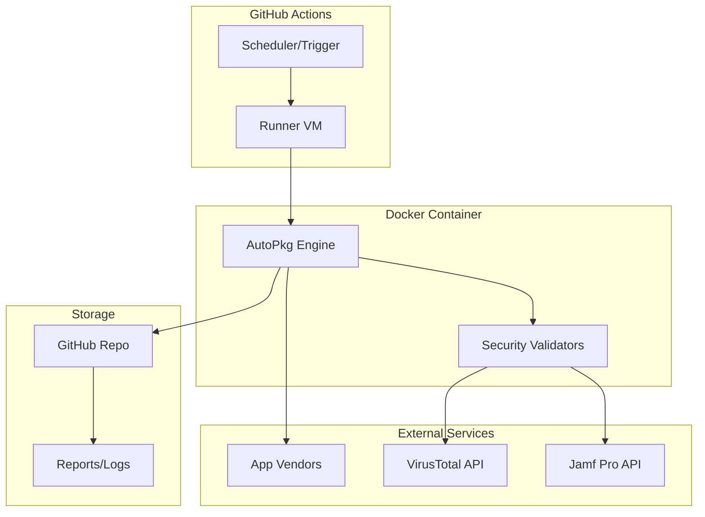

# MVP Implementation Plan - Cloud AutoPkg Runner

## Executive Summary

The MVP focuses on proving the core concept: **automated, secure patching of 3-5 low-risk applications with zero manual intervention**. This document outlines the minimal viable implementation that delivers immediate security value while establishing the foundation for future expansion.

## MVP Scope Definition

### What's IN Scope ✅

1. **Core Pipeline**
   - GitHub Actions orchestration
   - AutoPkg processing engine
   - Basic Jamf Pro upload capability
   - Git-based state management

2. **Limited Application Set** (3-5 apps)
   - Google Chrome
   - Mozilla Firefox
   - Zoom
   - (Optional) Slack
   - (Optional) Microsoft Teams

3. **Security Validation**
   - Mandatory code signature verification
   - VirusTotal malware scanning
   - SHA256 hash validation

4. **Deployment Target**
   - Single, static Jamf Pro test policy
   - Package overwrite capability only
   - No policy creation or modification

### What's OUT of Scope ❌

- Automated notifications (Slack/Teams/Email)
- Progressive deployments or canary rollouts
- Dynamic Jamf Pro policy creation
- Patch Software Title management
- Rollback capabilities
- Multi-environment support
- Custom reporting dashboards
- Integration with other MDM solutions

## Implementation Phases

### Phase 1: Foundation (Week 1)
**Goal**: Establish core infrastructure and repository structure

#### Components:
```
cloud-autopkg-runner/
├── .github/
│   └── workflows/
│       └── autopkg-run.yml    # Basic workflow
├── autopkg/
│   ├── RecipeList.txt         # 3 apps only
│   └── overrides/             # Recipe overrides
├── docker/
│   └── Dockerfile             # AutoPkg container
└── README.md                  # Basic documentation
```

#### Deliverables:
- [ ] GitHub repository with proper structure
- [ ] Basic GitHub Actions workflow (manual trigger only)
- [ ] Docker container that runs AutoPkg
- [ ] Successfully process one app locally

#### Success Criteria:
- Manual workflow execution completes without errors
- Docker container builds and runs AutoPkg
- One app (Chrome) processes successfully

### Phase 2: Security Integration (Week 2)
**Goal**: Implement mandatory security validation

#### Components:
```python
# Security validation pipeline
1. Download package
2. Verify code signature
3. Submit to VirusTotal
4. Check detection ratio
5. Pass/Fail decision
```

#### Deliverables:
- [ ] CodeSignatureVerifier processor integration
- [ ] VirusTotal API integration
- [ ] Validation failure handling
- [ ] Security report generation

#### Success Criteria:
- All packages pass signature verification
- VirusTotal scans complete successfully
- Failed validation stops processing
- Security report generated for each run

### Phase 3: Jamf Upload (Week 3)
**Goal**: Upload validated packages to Jamf Pro

#### Components:
```yaml
# Jamf upload configuration
JAMF_URL: https://your-instance.jamfcloud.com
JAMF_USERNAME: api-user
JAMF_PASSWORD: ****
TARGET_POLICY: "Test-AutoPkg-Apps"
REPLACE_PKG: true
```

#### Deliverables:
- [ ] Jamf API authentication
- [ ] Package upload functionality
- [ ] Overwrite existing packages
- [ ] Upload status reporting

#### Success Criteria:
- Packages upload to Jamf Pro successfully
- Existing packages are replaced
- Upload failures are logged
- No manual intervention required

### Phase 4: Automation & Scheduling (Week 4)
**Goal**: Enable fully automated execution

#### Components:
```yaml
# GitHub Actions schedule
schedule:
  - cron: '0 2 * * *'  # 2 AM daily
workflow_dispatch:      # Manual trigger
  inputs:
    app: ...
```

#### Deliverables:
- [ ] Scheduled workflow execution
- [ ] Manual trigger with parameters
- [ ] Basic error handling
- [ ] Execution logs

#### Success Criteria:
- Daily automated runs execute successfully
- Manual triggers work with app selection
- Failures don't break subsequent runs
- Logs are accessible in GitHub Actions

## Technical Architecture

### System Components



### Data Flow

1. **Trigger** → GitHub Actions workflow starts
2. **Initialize** → Docker container launches
3. **Process** → AutoPkg downloads & validates apps
4. **Upload** → Validated packages sent to Jamf
5. **Report** → Results committed to repository

## Configuration Files

### 1. Recipe List (autopkg/RecipeList.txt)
```
GoogleChrome.jamf
Firefox.jamf
Zoom.jamf
```

### 2. GitHub Secrets Required
```
JAMF_URL
JAMF_USERNAME  
JAMF_PASSWORD
VIRUSTOTAL_API_KEY
```

### 3. Docker Image (docker/Dockerfile)
```dockerfile
FROM ubuntu:22.04
RUN apt-get update && apt-get install -y \
    python3 python3-pip git curl
RUN pip3 install autopkg
COPY entrypoint.sh /
ENTRYPOINT ["/entrypoint.sh"]
```

## Testing Strategy

### Pre-Production Testing

1. **Local Testing**
   ```bash
   # Test Docker container
   docker build -t autopkg-test .
   docker run -e JAMF_URL=... autopkg-test
   
   # Test single recipe
   autopkg run -v GoogleChrome.jamf
   ```

2. **Dry Run Mode**
   - Process apps without uploading
   - Validate all security checks
   - Generate reports only

3. **Single App Testing**
   - Test one app end-to-end
   - Verify Jamf upload
   - Check package replacement

### Production Validation

1. **Daily Monitoring**
   - Check GitHub Actions logs
   - Verify package timestamps in Jamf
   - Review security reports

2. **Success Metrics**
   - Zero manual interventions per week
   - < 12 hour patch availability
   - 100% security validation rate

## Risk Mitigation

### Identified Risks & Mitigations

| Risk | Impact | Mitigation |
|------|--------|------------|
| API Rate Limits | High | Implement exponential backoff |
| Package Corruption | High | SHA256 validation + VirusTotal |
| Jamf API Failure | Medium | Retry logic + alerting |
| GitHub Actions Downtime | Low | Manual trigger backup |
| Recipe Breakage | Medium | Pin recipe versions |

## Rollout Plan

### Week 1-2: Development
- Set up repository
- Implement core functionality
- Local testing

### Week 3: Staging
- Deploy to test environment
- Process test packages
- Validate Jamf uploads

### Week 4: Production
- Enable scheduled runs
- Monitor for 1 week
- Gather metrics

### Week 5: Evaluation
- Review success metrics
- Document lessons learned
- Plan next phase

## Success Criteria

### MVP is successful when:

1. **Automation**: Zero manual touches for 5 consecutive days
2. **Security**: 100% of packages pass validation
3. **Reliability**: > 95% successful run rate
4. **Speed**: < 12 hours from vendor release to Jamf
5. **Scope**: 3+ apps successfully managed

## Next Steps After MVP

### Immediate Enhancements
1. Add email notifications for failures
2. Expand to 10 applications
3. Implement basic reporting dashboard

### Phase 2 Features
1. Progressive deployment strategies
2. Automatic rollback capabilities
3. Multiple environment support
4. Slack/Teams integration

### Long-term Vision
1. Self-service app additions
2. Custom recipe creation UI
3. Multi-MDM support
4. AI-powered failure resolution

## Appendix

### A. Required GitHub Secrets Setup

```bash
# Add secrets via GitHub CLI
gh secret set JAMF_URL --body "https://instance.jamfcloud.com"
gh secret set JAMF_USERNAME --body "api-user"
gh secret set JAMF_PASSWORD --body "secure-password"
gh secret set VIRUSTOTAL_API_KEY --body "your-api-key"
```

### B. Manual Testing Commands

```bash
# Test individual recipe
autopkg run -vv GoogleChrome.jamf

# Test with report only
autopkg run --report-plist report.plist GoogleChrome.jamf

# Verify package
pkgutil --check-signature /path/to/package.pkg
```

### C. Monitoring Queries

```sql
-- Jamf Pro: Check package upload times
SELECT package_name, uploaded_date 
FROM packages 
WHERE category = 'Testing'
ORDER BY uploaded_date DESC;
```

### D. Emergency Procedures

1. **Pipeline Failure**
   - Check GitHub Actions logs
   - Verify API credentials
   - Run manual test

2. **Security Validation Failure**
   - Do NOT bypass validation
   - Investigate detection
   - Contact vendor if false positive

3. **Jamf Upload Failure**
   - Check Jamf Pro API status
   - Verify credentials
   - Test with curl command

---

## Document History

| Version | Date | Author | Changes |
|---------|------|--------|---------|
| 1.0 | 2024-01-15 | Team | Initial MVP definition |

## Contact

**Project Owner**: Mac Admins Team  
**Technical Lead**: [Your Name]  
**Escalation**: security@company.com